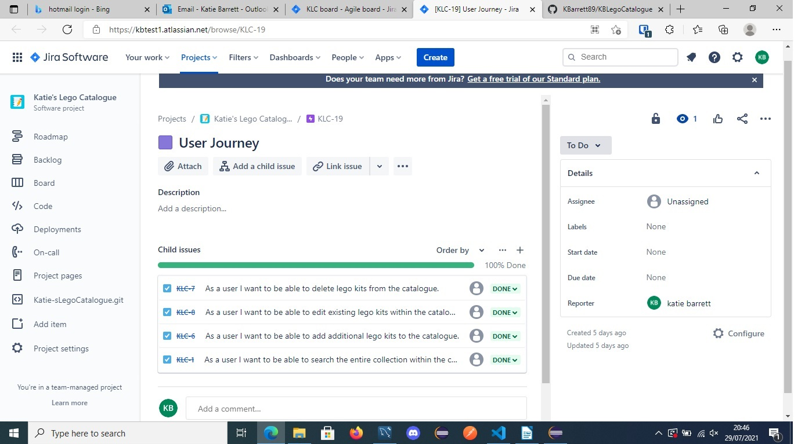
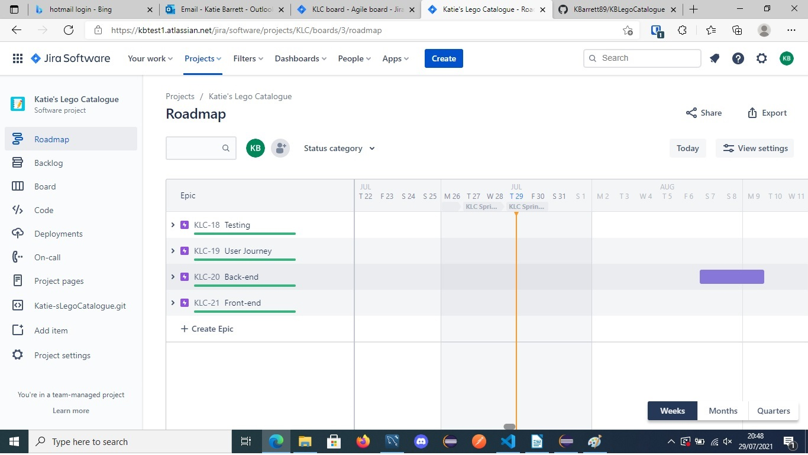
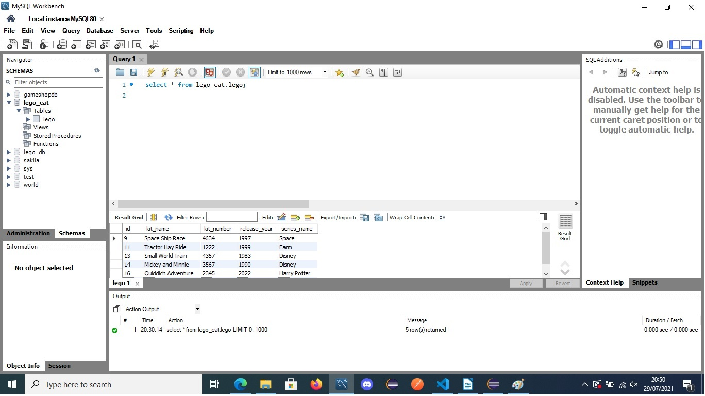
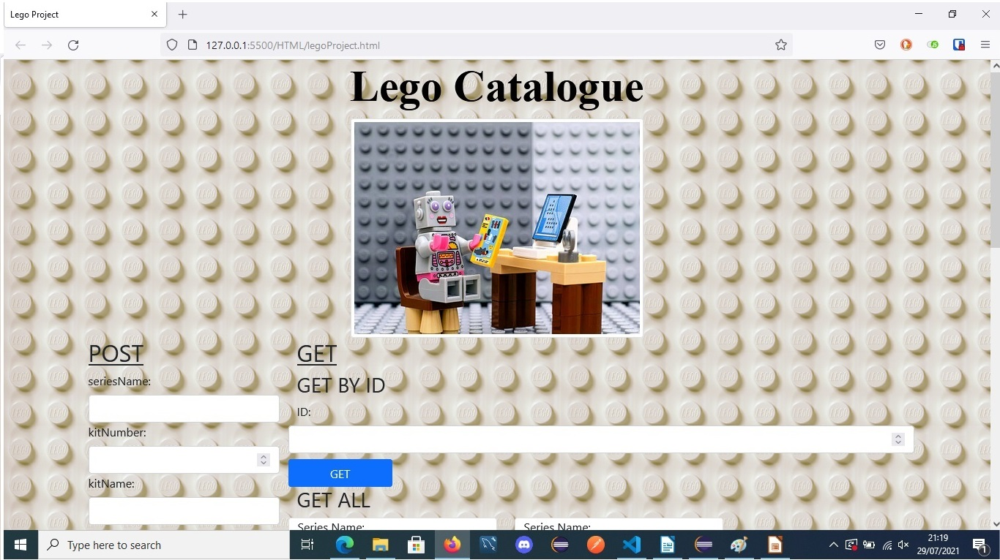
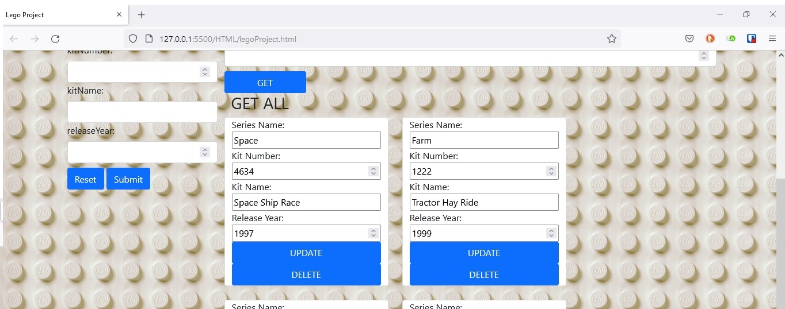
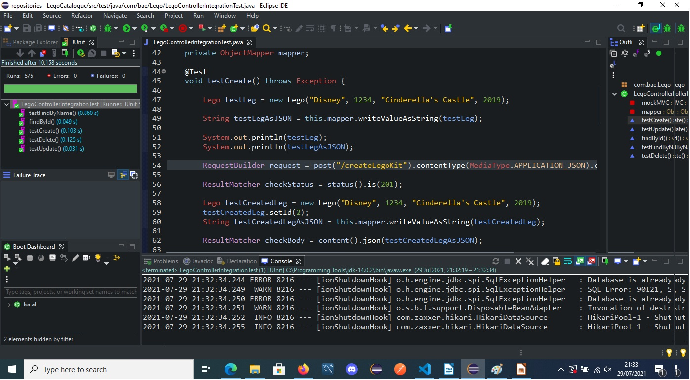
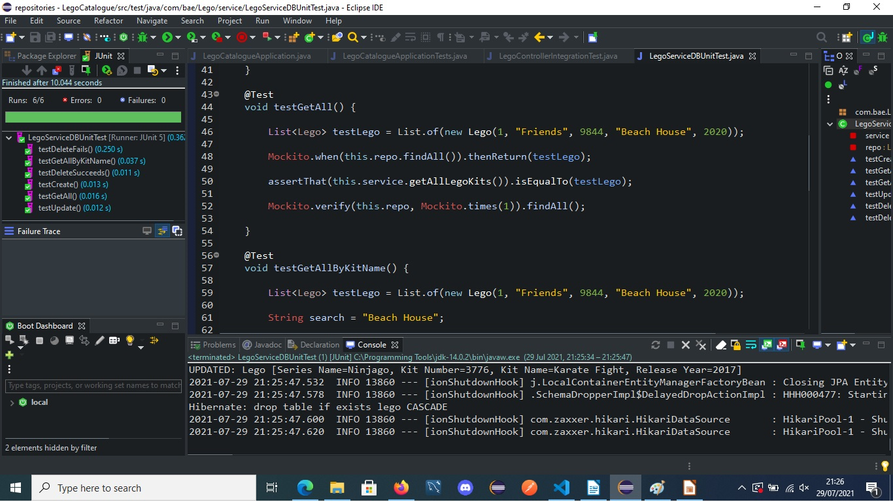
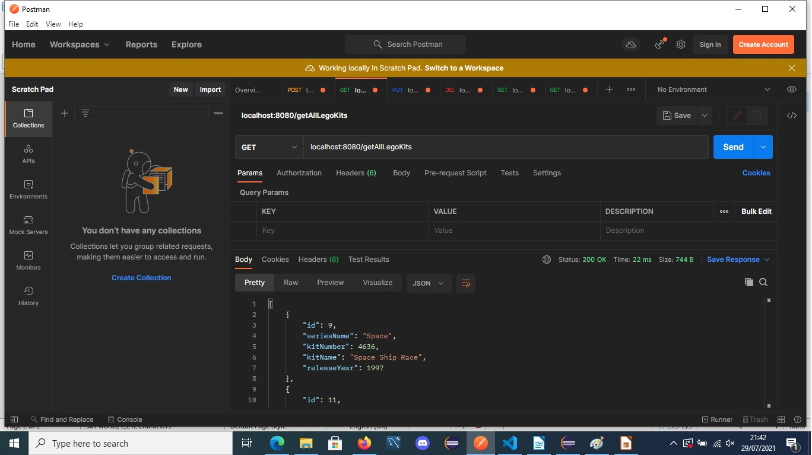

# KBLegoCatalogue

## Contents

    • Brief
    • Kanban Board
    • Database
    • Front-end
    • Testing
    • Stretch Goals
    • Acknowledgements

## Brief
To create a CRUD application, on my topic of choice, with the utilisation of supporting tools, methodologies and technologies that encapsulate all core modules covered during training.

    • Kanban: Jira
    • Database: SQL Server
    • Programming Language: Java (unless stated otherwise)
    • Front-end: HTML, CSS and Java Script
    • Unit Tests: JUnits and Mockito
    • Integration Tests: MockMVC
    • Verision Control: Git

## Kanban Board

https://kbtest1.atlassian.net/browse/KLC-19
      
I used Jira Software to create my Kanban board. I populated it with user stories, designed around the brief scope, which I connected to four Epics:
    • Testing
    • User Journey
    • Back-end
    • Front-end

## Database

I used MySQL to create and store my Lego_cat database.

## Backend
I created my back-end using Java, which I ran with the Spring Boot Framework to make the Application Programming Interface (API) accessible to my front-end. My back-end also had database logic which I utilised to access Lego Kit data stored within a database I had created in MySQL. This combination allowed my back-end to receive HTTP requests from my front-end and retrieve the relevant data from my MySQL.

## Frontend
I created my front end using HTML, CSS and JavaScript. My webpage was created using the HTML and JavaScript, which retrieved data for my webpage by interacting with my Java. By using CSS, and frameworks such as bootstrap, I was able to customise my webpage’s visual design. For example I imported a photo to use as a background, created cards for my Lego Kit data, and added a Lego scene picture. It also enabled me to create buttons to execute CRUD functions, and pop ups to confirm these functions had been successful.

## Testing
Integration Testing: I used MockMVC to probe my Application Programming Interface (API) to assess my create, read, update, delete (CRUD) functionality.

Unit Testing: I used Junit and Mockito to create a virtual testing zone where I passed mock Lego Kits to test my Java code’s functionality.

Manual Testing: I used Postman to manually test my CRUD functionality.

## Stretch Goals
    • Incorporate a Lego kit location guide.
    • Increased functions of Lego kit - description of kit, quantity, RRP.
    • Additional lookup methods – find by series name, kit number, kit name, release year.
    • More dynamic front-end.
      
## Acknowledgements
I would like to sincerely thank both of my amazing QA trainers, Jordan Harrison and Jordan Benbelaid, for all their help and patience with me whilst creating this project. I would also like to thank Team 1 for moral support, providing me with a rubber duck,  as well as advice on online resources and tutorials I could utilise.

## Project by Katie Barrett